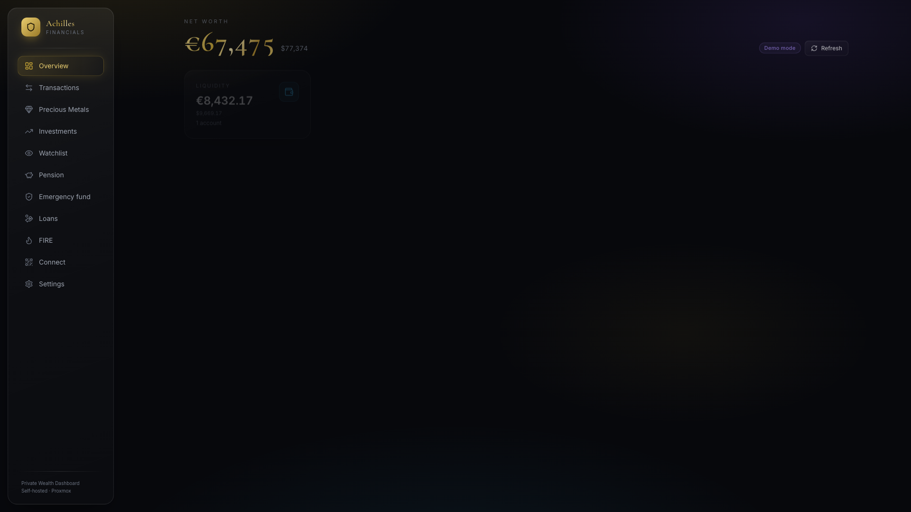
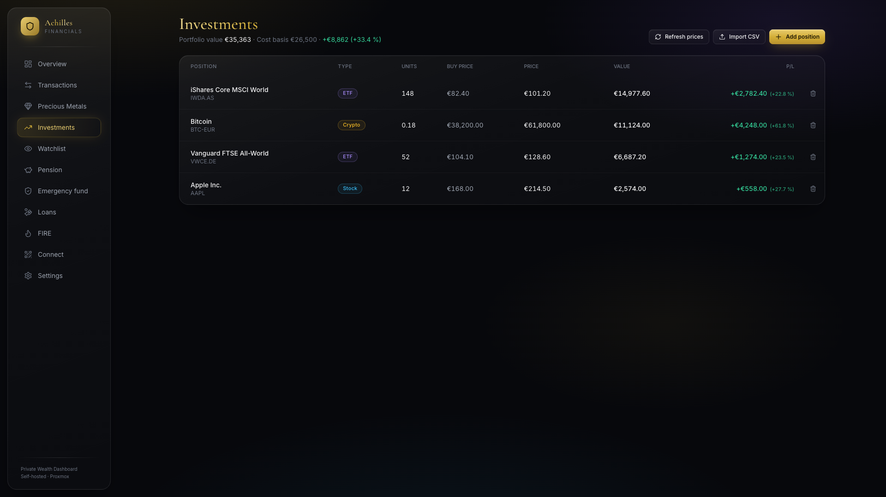
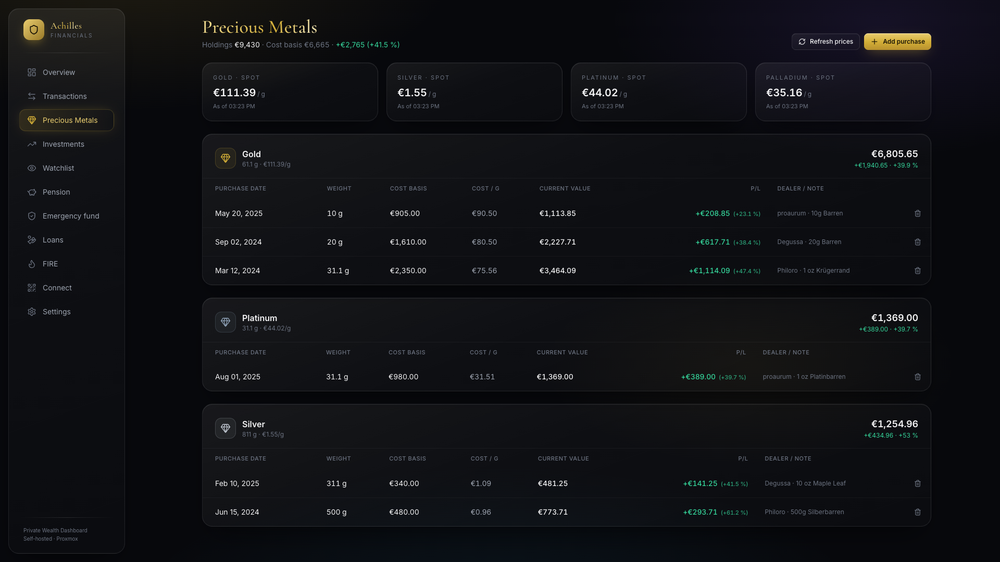
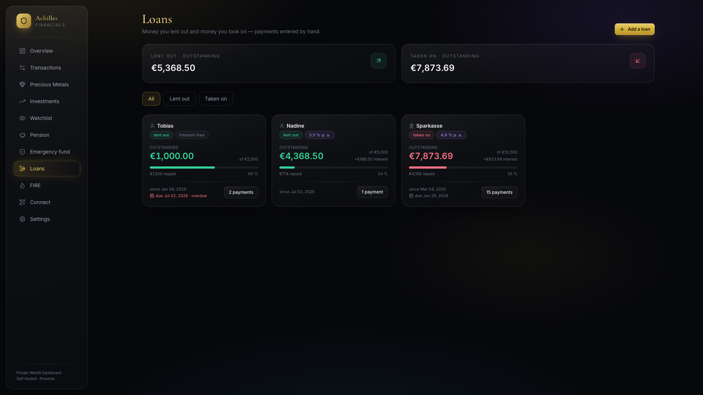
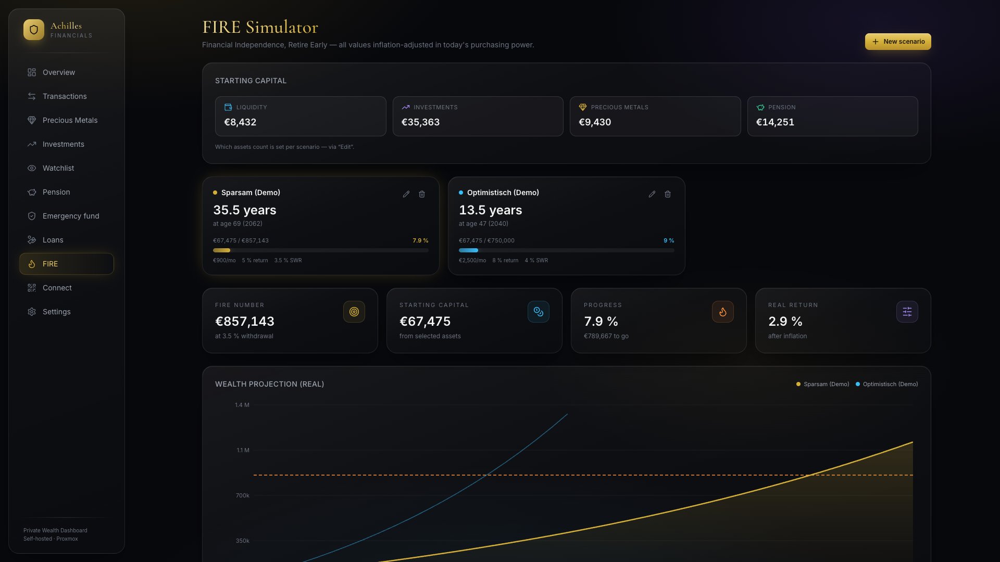
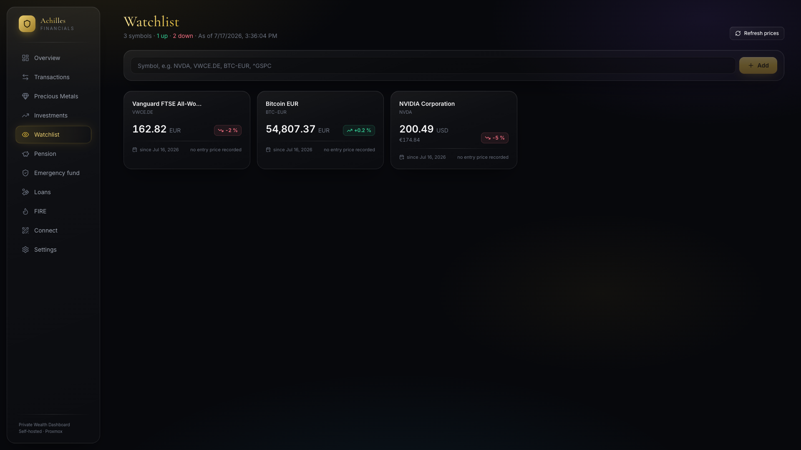
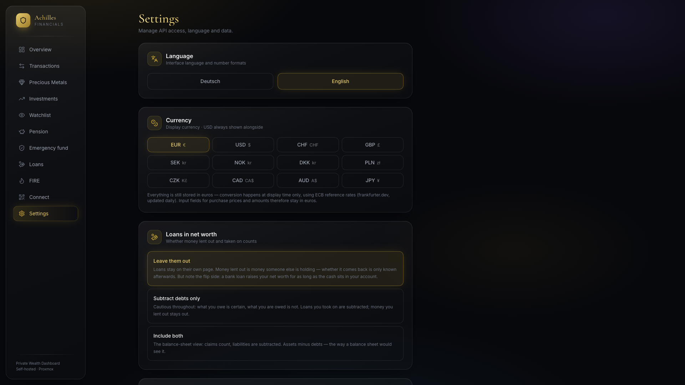
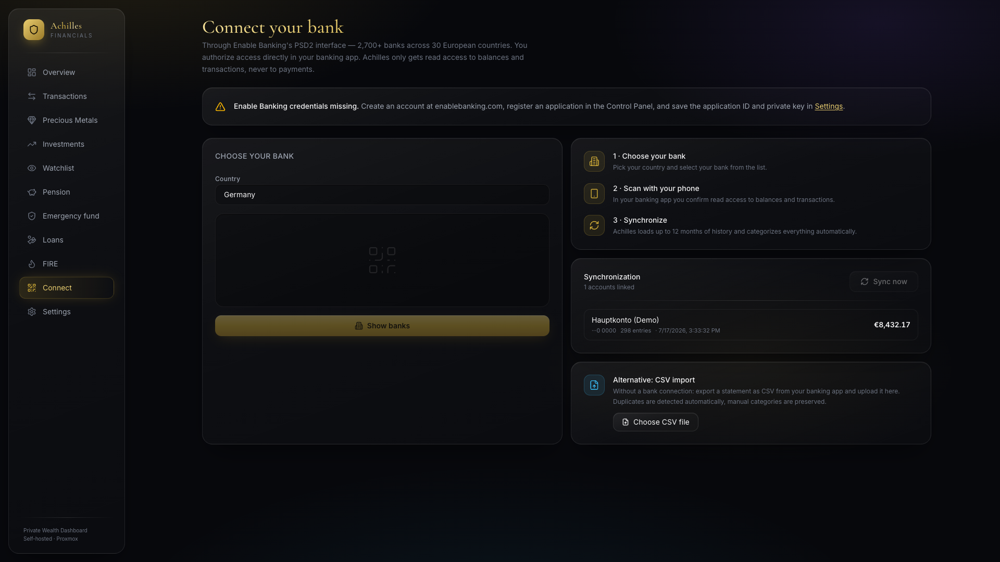
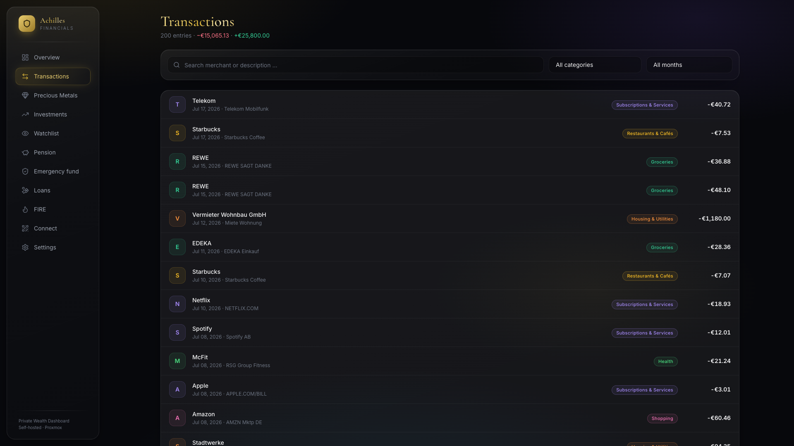
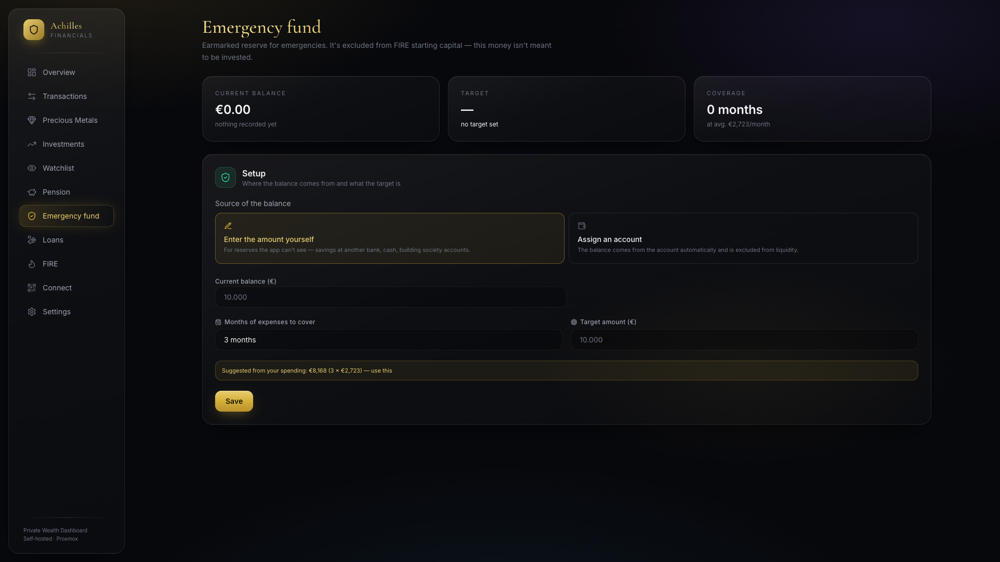

# 🏛️ Achilles Financials

**Self-hosted private wealth dashboard.** Connect your bank by scanning a QR code, then track
categorized spending, precious metals, investments with live prices and your pension — and simulate
your path to financial independence. Dark glassmorphism UI with a gold accent.

Works with **2,700+ banks across 30 European countries** through
[Enable Banking](https://enablebanking.com)'s PSD2 interface — read-only, revocable, and everything
stays on your own server.

> ⚡ **This project is 100 % vibe-coded.** Every line — app, design, deployment scripts, this README —
> was written by an AI coding agent ([Claude Code](https://claude.com/claude-code)) in conversation.
> No human wrote a single line of code. Review it accordingly before trusting it with your finances. 🤖

---



<table>
<tr>
<td width="50%"><a href="docs/screenshots/investments.png"></a><br><sub><b>Investments</b> — live prices, P/L per position</sub></td>
<td width="50%"><a href="docs/screenshots/metals.png"></a><br><sub><b>Precious metals</b> — every purchase as its own lot</sub></td>
</tr>
<tr>
<td><a href="docs/screenshots/loans.png"></a><br><sub><b>Loans</b> — lent out and taken on, with interest</sub></td>
<td><a href="docs/screenshots/fire.png"></a><br><sub><b>FIRE</b> — projections from your real net worth</sub></td>
</tr>
<tr>
<td><a href="docs/screenshots/watchlist.png"></a><br><sub><b>Watchlist</b> — pin favourites, drag to rearrange</sub></td>
<td><a href="docs/screenshots/settings.png"></a><br><sub><b>Settings</b> — language, currency, integrations</sub></td>
</tr>
</table>

<sub>Screenshots show the built-in demo data — load it from Settings and click around before connecting anything.</sub>


## Features

| | |
|---|---|
| 🏦 **Any European bank, by QR code** | Pick your country, search your bank, scan the QR code with your phone, approve in your banking app. Achilles pulls up to 12 months of history — balances and transactions only, never payment access. |
| 📄 **CSV import that adapts** | No API account needed. Delimiter, header row and column meanings are detected from the file, not assumed — German and English number formats, separate debit/credit columns, preambles. Works for statements *and* broker exports (holdings or order lists, netted into positions). |
| 🏛️ **FinTS for German banks** | No public domain required, no aggregator: Achilles talks to your bank directly. Fetches transactions and — where the bank supports HKWPD — your portfolio holdings. |
| 🏷️ **Auto-categorization** | Rule-based categories (groceries, subscriptions, housing, …). Manual overrides stick and survive re-syncs. |
| 🥇 **Precious metals** | Track every purchase as its own lot — grams, cost basis, date, dealer. Live spot prices for gold, silver, platinum and palladium show current value and P/L per lot and per metal. |
| 📈 **Investments + live prices** | Stocks, ETFs, crypto. Add a Yahoo-format symbol (`AAPL`, `VWCE.DE`, `BTC-EUR`) and refresh every price with one click, including USD→EUR conversion. |
| 👀 **Watchlist** | Watch any symbol with its price, daily change and gain since you added it. Pin favourites to the top, drag tiles to rearrange, hover for a 6-month chart. |
| 🤝 **Loans** | Money you lent out and money you took on — privately or from a bank, with or without interest. Interest accrues daily on the outstanding balance; payments cover interest first, then principal. You choose whether they count towards net worth. |
| 🔥 **FIRE simulator** | Inflation-adjusted wealth projection, your FIRE number, and years to financial independence — interactive sliders, seeded from your real net worth. |
| 🐷 **Pension tracking** | Log balances from your pension statements and split contributions across ETFs by weight; the latest balance feeds into net worth and the FIRE simulation. <br>[Screenshot](docs/screenshots/pension.png) |
| 🌍 **English & German** | Pick your language in the first-run setup wizard; switch anytime. Number and date formats follow. |
| 💱 **Your currency** | Display everything in one of twelve currencies, with **USD always shown alongside**. Amounts stay in EUR internally; conversion happens at display time with ECB reference rates. |
| ⬆️ **Self-updating** | Settings → Updates shows what's new since your version and installs it on click. Or one line in the shell. |
| 🔐 **Login** | Username + password (scrypt), enabled in Settings. Off by default so a fresh install can't lock you out — turn it on before anyone else can reach the host. |
| 💾 **Encrypted backup** | Settings → Backup downloads a password-protected `.achillesbak` (AES-256-GCM). It contains your banking private key, so it's never written in the clear — and never restorable without the password. |
| 🔎 **Every outbound call, listed** | Settings → External services names each service Achilles contacts, **what actually leaves your server**, when, and the source file to check the claim. Six entries, compiled from every `fetch()` in the code. |
| 🔒 **Private by design** | One SQLite file on your server. No analytics, no telemetry, no third-party scripts, fonts or tracking pixels. |

## Quick start (local)

```bash
git clone https://github.com/lcsfls/achilles-financials.git
cd achilles-financials
npm install
npm run dev        # → http://localhost:3000
```

The setup wizard walks you through language, the optional bank connection, and demo data. Demo mode
fills the dashboard with realistic sample data so you can explore before connecting anything real.

## Deployment

### Proxmox — one command

Run on your Proxmox VE host as root:

```bash
bash <(curl -fsSL https://raw.githubusercontent.com/lcsfls/achilles-financials/main/deploy/proxmox-install.sh)
```

Creates an unprivileged Debian 12 LXC (`nesting=1`), installs Docker, clones this repo, builds the
image, starts the app, and wires up the in-app updater.

Storage is detected automatically — if your host has exactly one container storage it's used, and if
there are several the script lists them (with free space) and asks. Pass `STORAGE=<name>` to skip the
question; `pvesm status --content rootdir` shows the names on your host.

All defaults are overridable:

```bash
CTID=120 STORAGE=local-zfs BRIDGE=vmbr0 NET_IP=192.168.1.50/24 NET_GW=192.168.1.1 \
  bash <(curl -fsSL https://raw.githubusercontent.com/lcsfls/achilles-financials/main/deploy/proxmox-install.sh)
```

### Docker Compose (any host)

```bash
git clone https://github.com/lcsfls/achilles-financials.git
cd achilles-financials
APP_URL=http://<your-lan-ip>:3000 docker compose up -d --build
```

`APP_URL` **must** be the address reachable from your phone — your bank redirects back to it after
authorization. Data lives in the `achilles-data` volume (`/data/achilles.db`); backing up that single
file is a full backup:

```bash
docker run --rm -v achilles-data:/data -v $(pwd):/backup debian \
  tar czf /backup/achilles-backup.tar.gz /data
```

Or use **Settings → Backup** for an encrypted `.achillesbak` you can download and restore from the
browser — no shell needed.

## Tutorials

Everything below assumes Achilles is running and you have opened it in a browser.

<details open>
<summary><b>1 · First run — click around before committing anything</b></summary>

The setup wizard asks for your language and country. You do **not** need a bank connection to start.

1. Go to **Settings → Demo data → Load demo data**. You now have a year of transactions, metal lots,
   a portfolio, a pension history and loans — exactly what the screenshots above show.
2. Walk through the nav. Nothing here talks to your bank yet.
3. When you are done, **Settings → Remove demo data** deletes every demo row and leaves anything you
   added yourself untouched.

> Loading demo data on top of real data mixes the two. Achilles warns you first and tells you how
> many real accounts it found — read that dialog rather than clicking through it.

</details>

<details>
<summary><b>2 · Getting your data in — three ways</b></summary>



**By QR code (Enable Banking, 2,700+ banks).** Settings → Integrations → enable Enable Banking, then
**Connect** → pick your country → search your bank → scan the QR code with your phone → approve in
your banking app. Achilles pulls up to 12 months of history.
Needs a public HTTPS address — see [Connecting your bank](#connecting-your-bank) below.



**By CSV (works everywhere, no account).** Export a statement from your banking app,
then **Connect → CSV import**. The format is detected, not assumed: delimiter, header row and columns
are read from your file. Duplicates are recognised, and categories you set by hand survive re-imports.

**By FinTS (German banks, no public domain needed).** Settings → Integrations → FinTS. You need your
bank's FinTS URL, your login and a **product ID** — see [FinTS registration](#fints-registration).
This talks to your bank directly, with no aggregator in between.

</details>

<details>
<summary><b>3 · Precious metals — every purchase is its own lot</b></summary>


**Precious Metals → Add purchase.** Enter grams, the **total** you paid, and the date.

Each purchase stays a separate lot with its own cost basis, so buying gold three times at three
prices gives you three honest P/L numbers instead of one blurred average. Spot prices come from
gold-api.com and update on **Refresh prices**.

</details>

<details>
<summary><b>4 · Investments — by hand, by CSV, or from your bank</b></summary>


**By hand:** *Add position*. Give it a **Yahoo-format symbol** (`AAPL`, `VWCE.DE`, `IWDA.AS`,
`BTC-EUR`) and *Refresh prices* keeps it current. Without a symbol you maintain the price yourself.

**By CSV:** *Import CSV* reads a broker export. Two shapes are handled — a **holdings list** (one row
per position) and an **order list** (one row per buy/sell), which is netted into positions at
weighted average cost, fees included. Re-importing updates instead of duplicating.

**From your bank:** with FinTS configured, *Fetch portfolio* pulls your depot directly.

> Banks identify securities by **ISIN**, which Yahoo cannot price. Achilles merges those into an
> existing position by name where it can, so `865985` lands on your `AAPL` rather than counting Apple
> twice. Where no match exists, the dialog tells you plainly that *Refresh prices* will skip it —
> add the Yahoo symbol by hand and it works.

</details>

<details>
<summary><b>5 · Loans — with or without interest</b></summary>


**Loans → Add a loan.** Choose the direction (you lent it out / you took it on), the counterparty,
the amount, and optionally a rate and a due date. Then record payments as they happen.

How the interest is calculated — stated openly, because a plausible number and a correct one look
identical:

- On the balance **still outstanding**, not the original sum.
- Daily, on **act/365** (actual days ÷ 365).
- **Simple** — accrued interest is not compounded.
- A payment **covers accrued interest first**, then principal, the way a bank does it.

**Settings → Loans in net worth** decides whether any of this touches your net worth. The default
leaves loans out entirely. Worth knowing: that is cautious about money you lent out, but generous
about money you owe — a bank loan lifts your net worth for as long as the cash sits in your account.
*Subtract debts only* is the consistently cautious choice.

</details>

<details>
<summary><b>6 · Emergency fund and FIRE</b></summary>




**Emergency fund:** point it at an account, or enter a figure by hand if the money sits somewhere
Achilles cannot see. Set a target in months of spending. That money is then **excluded from FIRE
starting capital** — earmarked reserves are not investable wealth.

**FIRE:** *New scenario* opens the calculator. Set your age, monthly spending, savings rate, expected
return and inflation. Starting capital is seeded from your **real** net worth, and you pick which
parts count — cash, metals, investments, pension. Save several scenarios and compare them; each keeps
its own progress.

</details>

<details>
<summary><b>7 · Making it yours</b></summary>

- **Currency** — Settings → Currency. Twelve currencies, with USD always shown alongside. Stored in
  EUR, converted only for display, so nothing is rewritten in your database.
- **Watchlist** — pin the symbols you actually follow to the top, drag tiles to swap them, hover for
  a 6-month chart.
- **Login** — Settings → Login. Off by default so a fresh install cannot lock you out. **Turn it on
  before the host is reachable by anyone else.**
- **Backup** — Settings → Backup downloads a password-protected `.achillesbak`. It holds your banking
  private key and every transaction, so it is never written in the clear — and never restorable
  without the password. Keep the password somewhere other than the file.
- **What leaves your server** — Settings → External services lists every outbound call, what it
  sends, and where in the source to verify it.

</details>

## Connecting your bank

Personal accounts can only be reached through a licensed PSD2 provider — talking to banks directly
would require a qualified eSeal certificate (~€1–2k/year). Achilles uses **Enable Banking**, a
Finnish AISP covering 2,700+ banks in 30 European countries. Their *Restricted Production* tier is
free for personal use: real production data, but only from accounts you whitelist yourself — exactly
what a personal dashboard needs.

1. Create an account at [enablebanking.com](https://enablebanking.com)
2. Register an application in the Control Panel. Set the redirect URL to
   `https://<your-host>/api/bank/callback` (Settings shows the exact URL for your install).
   You'll get an **Application ID** and a **private key** (`.pem`).
3. Paste both into the setup wizard or under **Settings**. They're stored only in your local SQLite.
4. **Connect** → pick country → search your bank → scan the QR code → approve in your banking app → **Sync**

Access is read-only, valid for up to 180 days, and revocable in your banking app at any time.
Prefer not to register at all? Use the **CSV import** on the Connect page.

### Two things production access requires

**HTTPS.** Enable Banking rejects a plain `http://192.168.x.x:3000` redirect URL, so a LAN-only
install can't complete the QR flow as-is. Put a reverse proxy with a real certificate in front —
Nginx Proxy Manager, Caddy, a Cloudflare Tunnel or `tailscale serve` all work. Two things matter:
the certificate must be one your **phone** trusts (a self-signed one means a warning to click
through at best), and the domain has to resolve from the phone.

Then tell Achilles its own address under **Settings → Public address of this instance**
(e.g. `https://achilles.your-domain.com`). Without it the app builds the redirect URL from the
request it happens to see — behind a proxy that's the internal `http://…:3000`, which is exactly
what gets rejected. Settings shows the redirect URL it will actually send, and warns when it isn't
HTTPS. That's the string to register in the Control Panel.

**A privacy policy and terms of service.** Activating a production application requires a link to
each, plus a data protection contact email — and Enable Banking monitors that those links stay
reachable. For a personal instance that means publishing two short pages somewhere public.

Neither applies to the CSV import, which is why it exists.

> **Note:** one bank at a time. Multiple accounts *within* that bank all sync; connecting several
> different banks in parallel isn't supported yet.

## Updating

**In the app:** *Settings → Updates* checks this repo, lists what's new since your version, and
installs it on click. The app writes a request to `control/`, a systemd watcher on the host runs
`deploy/update.sh`, which pulls and rebuilds. Your database is untouched. The Proxmox installer sets
this up automatically.

**In the shell** — one line, inside the LXC/host:

```bash
/opt/achilles-financials/deploy/update.sh
```

Or from the Proxmox host (replace `120` with your CTID):

```bash
pct exec 120 -- /opt/achilles-financials/deploy/update.sh
```

Idempotent: it exits early if you're already on the latest commit, and logs to `control/update.log`.

> In-app updates need `./control` bind-mounted and the systemd watcher installed (the Proxmox
> installer does both). Without it, the app still *checks* for updates and shows you the shell command
> to copy — it just won't run it itself. The app never gets access to the Docker socket.

## FinTS registration

FinTS access has required a **registered product** since 1 August 2019. The registration covers *the
application a user runs*, is **free**, and takes 10–15 working days. There is no exemption for open
source or private use.

Achilles deliberately ships **no** product ID. It is source code you run yourself, so registration is
yours to do — enter your number under Settings → Integrations → FinTS. Without one, most banks answer
`9050 / 3078 — Software nicht als FinTS-Produkt registriert`, which Achilles translates for you.

Apply at [fints.org → Produktregistrierung](https://www.fints.org/de/hersteller/produktregistrierung).
Enable Banking and CSV import need none of this.

## Stack

Next.js 15 (App Router, standalone output) · React 19 · Tailwind CSS 4 · shadcn-style UI (Radix)
· Recharts · better-sqlite3 · Docker multi-stage build

Data sources: [Enable Banking](https://enablebanking.com) (PSD2 banking) ·
[gold-api.com](https://gold-api.com) (metal spot prices) · Yahoo Finance (stocks/ETFs/crypto) ·
[frankfurter.app](https://frankfurter.app) (FX rates)

## Disclaimer

A hobby project, built entirely by an AI, for personal use on a private network. It has **no
authentication layer** — don't expose it to the public internet without a reverse proxy with auth
(Authelia, Tailscale, VPN, …) in front of it. Nothing in this app is financial advice.
